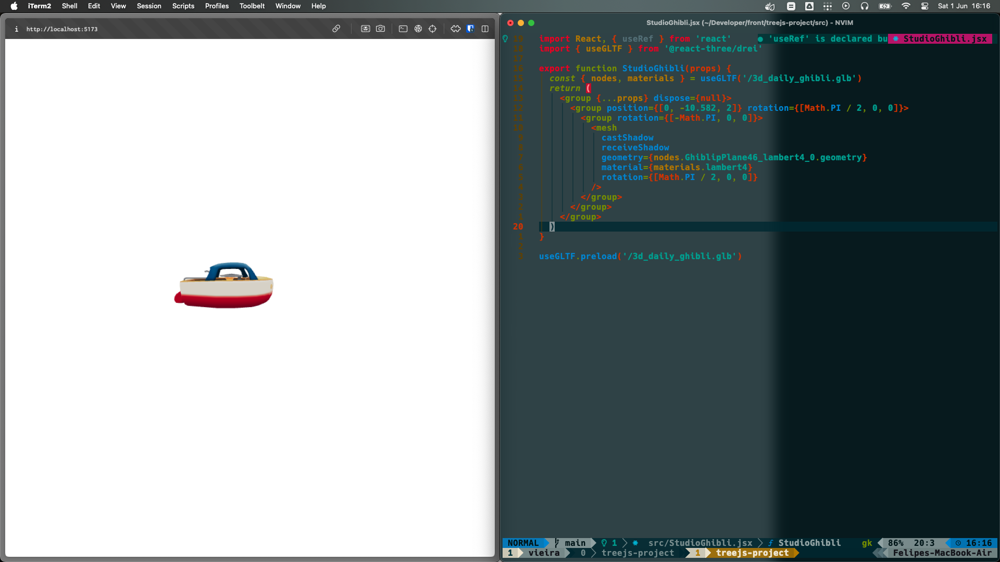
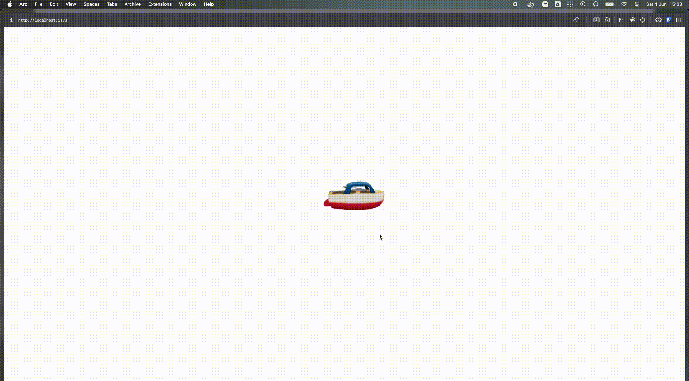
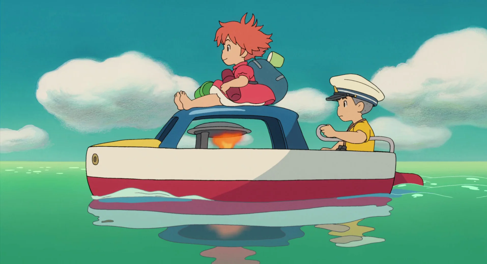

# Studio Ghibli Three.js





- React - A JavaScript library for building UIs
- [Three.js](https://threejs.org/) - JavaScript 3D library
- [React Three Fiber](https://github.com/pmndrs/react-three-fiber) - A React renderer for Three.js
- [@react-three/drei](https://github.com/pmndrs/drei) - Useful helpers for Fiber

## How to use

```sh
git clone git@github.com:Fefevs09/Three.js-project.git
cd Three.js-project/
npm i
npm start
```

## References


